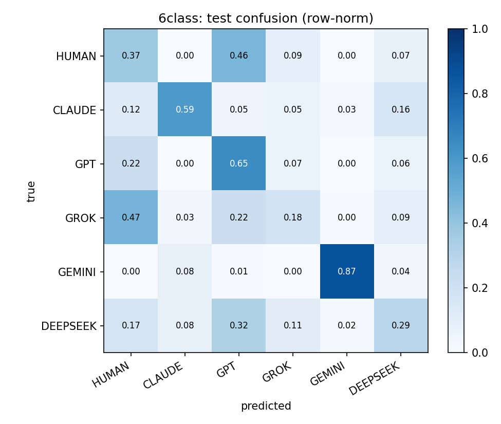
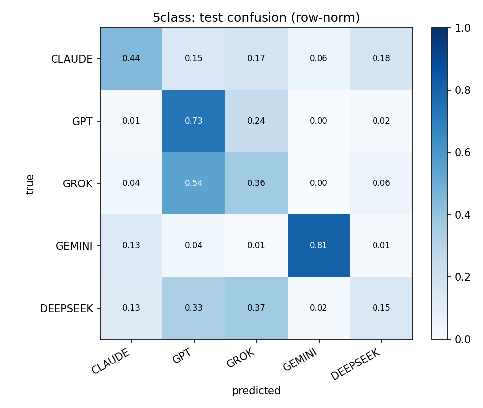

# CRS provenance classifier

Six-class and five-class provenance classifiers over Congressional Research Service (CRS) report prose, trained to separate human-authored CRS text from paraphrases produced by five frontier LLMs. DeBERTa-v3-large with rank-16 LoRA adapters, fit on 50,737 balanced training chunks. Two of five providers carry a separable signature at this scale; three do not, and the classifier collapses uncertain predictions onto a joint HUMAN/GPT attractor.

## Dataset

Phase 1 downloaded 23,156 CRS reports from everycrsreport.com spanning 2010–2024, after which a 200-report stratified audit gated a second cleanup pass against orphan headers, HTML entities, and table captions. Phase 2 tokenized each cleaned body into 512-token sentence-aligned chunks using the RoBERTa-large tokenizer, yielding 507,729 human chunks indexed by report ID and publication year. Phase 3 sampled chunks for paraphrase generation through OpenRouter and direct provider APIs, producing roughly 10,000 paired (human-chunk, AI-paraphrase) records per provider against `claude-haiku-4.5`, `gpt-5.4-mini`, `grok-4.20`, `gemini-3-flash-preview`, and `deepseek-v4-flash`.

Phase 4 (`workspace/scripts/crs/phase4_repool.py`) pooled AI chunks across all years and split them randomly into 8,000+ train / 1,000 val / 500 test per class, while human chunks retained a temporal split (train 2010–2018, val 2019, test 2020) to preserve realistic distributional drift on the human side. The final compiled dataset at `workspace/data/compiled2/{train,val,test}.jsonl` contains 50,737 / 6,000 / 3,000 chunks, balanced to 8,000–8,599 per class in train and exactly 1,000 / 500 per class in val / test.

## Training

Backbone `microsoft/deberta-v3-large` in bf16, sequence length 256, batch 32, 3 epochs, learning rate 2e-5, warmup ratio 0.06, weight decay 0.01. PEFT LoRA at rank 16, alpha 32, dropout 0.05, with the classifier head fully trainable via `modules_to_save=["classifier","score","pooler"]`. Class-weighted cross-entropy compensates for the small HUMAN train imbalance (8,000 vs 8,500–8,599). Model A (six classes including HUMAN) and Model B (five classes, AI-only) trained in parallel on a single RTX 5090 in 9,262 s and 8,569 s respectively (~2h35m wall, 32GB used).

## Results

| class | 6-class P | R | F1 | 5-class P | R | F1 |
|---|---:|---:|---:|---:|---:|---:|
| HUMAN    | 0.273 | 0.374 | 0.316 | — | — | — |
| CLAUDE   | 0.751 | 0.590 | 0.661 | 0.589 | 0.442 | 0.505 |
| GPT      | 0.379 | 0.648 | 0.478 | 0.408 | 0.730 | 0.523 |
| GROK     | 0.367 | 0.184 | 0.245 | 0.315 | 0.364 | 0.338 |
| GEMINI   | 0.944 | 0.870 | 0.905 | 0.912 | 0.812 | 0.859 |
| DEEPSEEK | 0.407 | 0.290 | 0.339 | 0.361 | 0.150 | 0.212 |
| **macro** |  | 0.493 | **0.491** |  | 0.500 | **0.488** |
| accuracy |  |  | 0.493 |  |  | 0.500 |
| ECE      |  |  | 0.057 |  |  | 0.035 |
| HUMAN→AI FPR |  |  | 0.626 |  |  | — |

Confusion matrices (row-normalized) at `docs/figures/final_confusion_{6,5}class.png`; combined LaTeX report at `docs/results_combined.pdf`.




## Findings

**1. HUMAN and GPT act as joint attractor classes.** True-HUMAN samples land more often in the GPT bucket (46.4%) than in their own (37.4%); the GPT column absorbs 855 of 3,000 test predictions at precision 0.379, and the HUMAN column another 684 at precision 0.273. Off-diagonal mass concentrates in these two columns (1,028 of 2,500 non-self predictions), indicating that under uncertainty the classifier collapses onto whichever of HUMAN or GPT sits nearest the decision boundary for that chunk. Human CRS prose and GPT-paraphrased CRS prose occupy overlapping regions of feature space, with GPT serving as the generic-rewrite centroid that other providers' uncertain predictions also drift toward.

**2. Gemini is the only provider with a separable signature.** F1 0.905 in six-class, 0.859 in five-class, with a 1.04% false-positive rate (26 of 2,500 non-Gemini samples predicted as Gemini). The signature survives removal of HUMAN, ruling out a HUMAN/AI-boundary artifact. `gemini-3-flash-preview` retains a distinctive surface style even when conditioned on neutral CRS source text.

**3. Grok and DeepSeek lack identifying signal at this scale.** Recall 0.184 (Grok) and 0.290 (DeepSeek); F1 0.245 and 0.339. Grok samples flow predominantly into HUMAN (47.4%) and GPT (22%); DeepSeek samples spread across GPT (32.4%), HUMAN (17.2%), and Grok (11.2%). At 8,500 training chunks per class on DeBERTa-v3-large with sequence 256, these two providers produce paraphrases the classifier cannot reliably distinguish from one another or from the joint HUMAN/GPT centroid.

**4. Removing HUMAN redistributes confusion without eliminating it.** Macro F1 shifts from 0.491 to 0.488 while per-class movements are large in both directions: CLAUDE −0.156, DEEPSEEK −0.127, GEMINI −0.046, GPT +0.045, GROK +0.093. The GROK→GPT cell rises from 110 to 272 and DEEPSEEK→GROK from 56 to 184, because the HUMAN bucket had been draining low-confidence GROK and DEEPSEEK predictions, and removing that drain spills the same mass onto the remaining AI classes. HUMAN was not the source of AI-vs-AI confusion; the confusion is structural to the paraphrase task.

## Repo layout

| path | role |
|---|---|
| `workspace/scripts/crs/` | Pipeline phases 1–5 and `final_driver.sh` orchestrator |
| `workspace/data/crs_raw/` | 23,156 raw CRS reports (HTML + JSON), 6.4 GB |
| `workspace/data/crs_clean/` | Cleaned text bodies, 2.0 GB |
| `workspace/data/chunks/` | 507K 512-token human chunks, 2.6 GB |
| `workspace/data/generated/` | 54,460 paired AI paraphrases across 5 providers |
| `workspace/data/compiled2/` | Balanced train/val/test JSONL (50,737 / 6,000 / 3,000) |
| `workspace/models/checkpoints/crs_final_{6,5}class/seed42/best/` | LoRA adapters + tokenizer |
| `workspace/models/eval/final_results_{6,5}class.json` | Test metrics + confusion matrices |
| `workspace/outputs/results_combined.pdf` | Combined LaTeX report |
| `authinfra/` | Library code (datasets, training, inference utilities) |
| `docs/figures/`, `docs/results_combined.pdf` | Staged figures + report mirrored for this README |

The `apps/web/`, `services/`, `attic/`, and `tests/` trees predate the CRS experiment and are not part of the live pipeline.

## Reproducing

```bash
python3 workspace/scripts/crs/phase1_download.py
python3 workspace/scripts/crs/phase1b_audit.py
python3 workspace/scripts/crs/phase1c_postclean.py
python3 workspace/scripts/crs/phase2_chunk.py
python3 workspace/scripts/crs/phase3_or.py --provider {anthropic,openai,xai,google,deepseek}
bash    workspace/scripts/crs/final_driver.sh   # phase4_repool + dual phase5 + combined PDF
```

Provider keys live at `workspace/secrets.local` (gitignored). End-to-end generation cost $125.50 across direct provider APIs ($73.64) and an OpenRouter top-up ($51.86) for 54,460 paraphrases; training cost was zero, local on a single RTX 5090.

| provider | gens | cost |
|---|---:|---:|
| xai       | 10,000 | $52.54 |
| anthropic | 14,223 | $39.55 |
| openai    | 10,099 | $18.34 |
| deepseek  | 10,039 | $9.64  |
| google    | 10,099 | $5.43  |
| training (RTX 5090, local) | — | $0.00 |
| **total** | **54,460** | **$125.50** |
